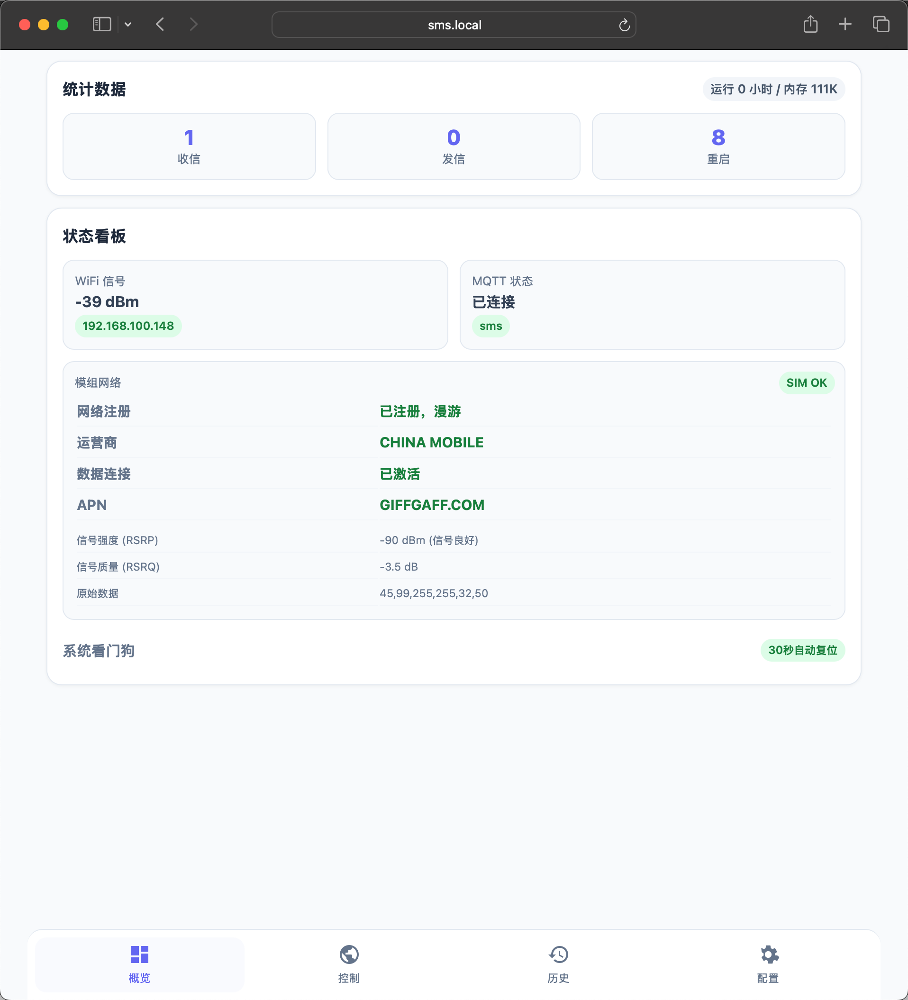
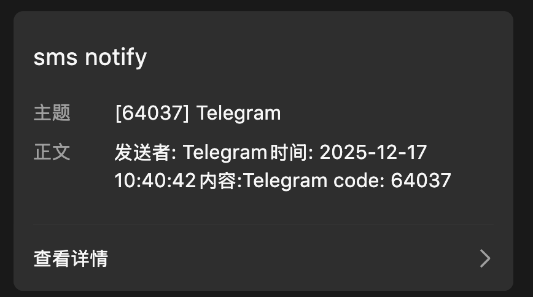
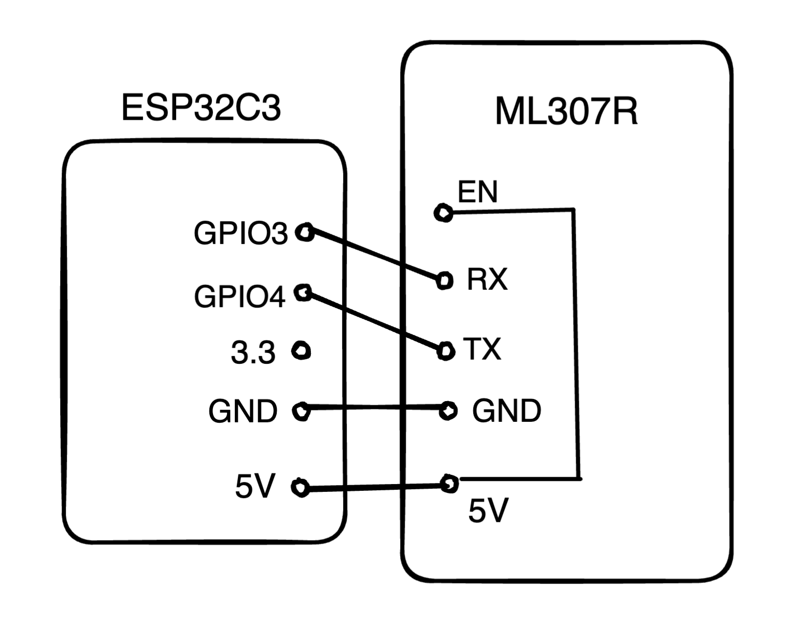
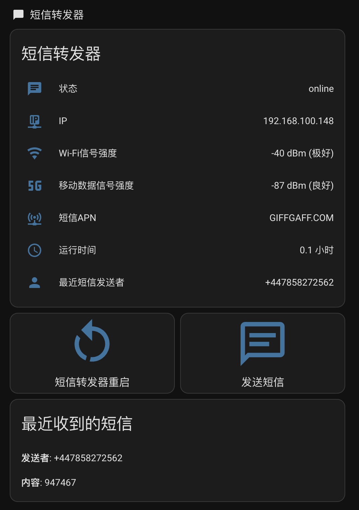

# 低成本短信转发器

用低成本硬件实现短信自动转发，只需要提供供电和WiFi即可，收到短信后自动推送到手机/邮箱/智能家居，再也不怕错过验证码！
虽然芯片标记的全网通，该项目可能不支持电信卡，使用电信卡会连不上网，具体请自测。

> 本项目基于 chenxuuu/sms_forwarding 进行二次开发，原项目采用 MIT 协议。本项目保留原作者版权声明，并在此基础上增加/改动了功能。
原项目固件的视频教程：[B站视频](https://www.bilibili.com/video/BV1cSmABYEiX),少部分不适用于当前修改版，大部分通用。

**删除的功能：** PushPlus、Server酱（可用自定义 Webhook 替代）

**主要改进：**
- 重构代码结构，模块化设计
- 新增 Telegram推送
- 全新现代化 Web 界面
- 完整的 MQTT 支持，可接入 Home Assistant，提供传感器配置和自动化蓝图




## 更新日志

- ✨ 新增 Telegram Bot 推送
- ✨ 新增企业微信机器人推送  
- ✨ 新增钉钉机器人推送
- ✨ 新增手动流量保号功能
- ✨ 新增 mDNS 支持（可用 `http://sms.local` 访问）
- ✨ 新增多 WiFi 配置（自动选择信号最强的网络）
- ✨ 新增黑白名单过滤功能
- ✨ 新增定时任务（定时Ping保活/定时发短信保号）
- ✨ 新增设备状态 MQTT 上报（信号强度、APN等）
- ✨ 新增自动 APN 识别（换卡自动适配）
- 🎨 全新现代化 Web 界面，支持手机和电脑端
- 🎨 概览页显示完整设备状态
- 🐛 修复多处 bug，优化稳定性


## 功能特点

### 核心功能
- 📱 收到短信自动转发到手机/邮箱
- 🔔 支持多种推送方式同时启用
- 🌐 网页配置，无需改代码
- 📡 支持 MQTT，可接入 Home Assistant 智能家居
- 📶 支持多WiFi配置，自动选择信号最强的网络

### 保号功能
- ⏰ 定时 Ping 或发送短信保号，避免卡被销号回收
- 🔋 手动流量保号（Ping 消耗少量流量）

### 控制功能
- 💬 网页/MQTT 发短信
- 🔄 设备远程重启
- 📊 实时状态监控（WiFi信号、4G信号、SIM卡状态）

## 通知方式

所有配置都在网页界面完成，支持同时开启多个：

| 方式 | 说明 |
|------|------|
| **邮件** | 收到短信发邮件通知 |
| **MQTT** | 接入智能家居（如 Home Assistant） |
| **Bark** | iPhone 推送通知 |
| **Telegram Bot** | Telegram 机器人推送 |
| **企业微信** | 企业微信机器人 Webhook |
| **钉钉** | 钉钉机器人 Webhook |
| **自定义 Webhook** | 推送到任意服务器 |





## 硬件准备

总成本约 **28元**：

| 硬件 | 价格 | 链接 |
|------|------|------|
| ESP32C3 Super Mini | ¥9.5 | [淘宝](https://item.taobao.com/item.htm?id=852057780489&skuId=5813710390565) |
| ML307R-DC 核心板 | ¥16.3 | [淘宝](https://item.taobao.com/item.htm?id=797466121802&skuId=5722077108045) |
| 4G 天线 | ¥2 | 同上链接 |

## 接线方式
#### 注意，rx和tx的针脚和 GPIO3  GPIO4不是垂直对应,要掰弯针脚，我是建议买焊接好的esp32c3，然后使用杜邦线连接，然后ML307R的 EN 要和 5V(VCC) 连接,否则无法正常运行

| 接线示意图 | 实物连接图 |
|:---:|:---:|
|  |  |


简单说就是：
- ESP32 的 **GPIO3** 接 ML307 的 **RX**
- ESP32 的 **GPIO4** 接 ML307 的 **TX**
- **GND** 接 **GND**
- **5V** 接 **VCC** 和 **EN**（让模块自动开机）

## 烧录步骤

### 1. 安装 Arduino IDE

下载安装 [Arduino IDE](https://www.arduino.cc/en/software)

### 2. 添加 ESP32 支持

1. 打开 Arduino IDE，点击 **文件 → 首选项**
2. 在"附加开发板管理器网址"填入：
```
   https://espressif.github.io/arduino-esp32/package_esp32_index.json
   ```
3. 点击 **工具 → 开发板 → 开发板管理器**
4. 搜索 `esp32`，安装 **esp32 by Espressif Systems**

### 3. 安装依赖库

点击 **工具 → 管理库**，搜索并安装：
- **ReadyMail** by Mobizt
- **pdulib** by David Henry
- **PubSubClient** by Nick O'Leary

### 4. 配置 WiFi

打开 `code/wifi_config.h`，修改成你的 WiFi：

```cpp
#define WIFI_SSID "你的WiFi名"
#define WIFI_PASS "你的WiFi密码"
   ```

### 5. 上传程序

1. 用 USB 线连接 ESP32C3 到电脑
2. 选择开发板：**工具 → 开发板 → esp32 → MakerGO ESP32 C3 SuperMini**
3. 更改存储分配：**工具 → Partition Scheme:xxxx → Huge app**
4. 选择端口：**工具 → 端口 → （选择出现的COM口）**
5. 点击上传按钮 ➡️

### 6. 开始使用

1. 插入 SIM 卡到 ML307 模块
2. 用 USB 给 ESP32 供电
3. 打开手机连接同一个 WiFi
4. 浏览器访问：
   - **推荐**：`http://sms.local`（无需记 IP，支持 Windows/macOS/iOS）
   - 或访问 ESP32 的 IP 地址（串口会打印）
5. 默认账号密码：`admin` / `admin123`
6. 在网页配置你想要的推送方式

> 💡 **mDNS 说明**：设备支持 mDNS，可以用 `sms.local` 域名访问。Android 系统可能不支持，需使用 IP 地址。

## 推送渠道配置

### Telegram Bot

1. 在 Telegram 找 @BotFather 创建机器人，获取 Token
2. URL 填写：`https://api.telegram.org/bot<你的Token>/sendMessage`
3. Chat ID 填写你的 Telegram 用户 ID（可以用 @userinfobot 获取）

### 企业微信机器人

1. 在企业微信群里添加机器人，获取 Webhook URL
2. URL 填写完整的 Webhook 地址

### 钉钉机器人

1. 在钉钉群设置中添加自定义机器人
2. 安全设置可以选择：
   - **自定义关键词**：消息内容需包含该关键词（推荐设置为"来自"）
   - **加签**：需要在配置页面填写加签密钥（Key1 字段）
   - **IP 地址段**：添加你服务器的公网 IP
3. URL 填写完整的 Webhook 地址
4. 如果选择了加签，在 Key1 字段填写加签密钥（以 SEC 开头）

## MQTT 功能（接入智能家居）

如果你用 Home Assistant 或其他智能家居平台，可以通过 MQTT 实现：

- 📥 收到短信自动推送到 HA
- 📤 通过 HA 远程发短信
- 📊 在 HA 显示信号强度、在线状态
</br></br>效果如下</br>

### 配置方法

1. 在网页界面展开"MQTT"
2. 填入你的 MQTT 服务器信息
3. 勾选启用，保存

### MQTT 主题说明

设备会用 MAC 地址后6位作为 ID，比如设备 ID 是 `a1b2c3`，主题前缀是 `sms`：

**设备上报的主题：**
| 主题 | 说明 |
|------|------|
| `sms/a1b2c3/status` | 设备状态（每60秒更新） |
| `sms/a1b2c3/sms/received` | 收到的短信内容 |

**发送命令到设备：**
| 主题 | 消息 | 说明 |
|------|------|------|
| `sms/a1b2c3/sms/send` | `{"phone":"138xxx","message":"内容"}` | 发短信 |
| `sms/a1b2c3/ping` | `{}` | 执行 Ping 测试 |
| `sms/a1b2c3/cmd` | `{"action":"restart"}` | 重启设备 |

### 状态信息

设备每60秒上报一次状态，包含：

```json
{
  "status": "online",
  "ip": "192.168.1.100",
  "wifi_rssi": -45,
  "wifi_status": "极好",
  "lte_rsrp": -85,
  "lte_status": "良好",
  "apn": "GIFFGAFF.COM"
}
```

| 字段 | 说明 |
|------|------|
| `status` | 在线/离线 |
| `wifi_rssi` | WiFi 信号强度 (dBm) |
| `wifi_status` | WiFi 信号评价（极好/很好/良好/一般/较弱/很差） |
| `lte_rsrp` | 4G 信号强度 (dBm) |
| `lte_status` | 4G 信号评价（极好/良好/一般/较弱/很差） |
| `apn` | 当前 APN |

### Home Assistant 配置示例


在 `configuration.yaml` 添加：

```yaml
mqtt:
  sensor:
    - name: "短信转发器"
      state_topic: "sms/a1b2c3/status"
      value_template: "{{ value_json.status }}"
      
    - name: "4G信号强度"
      state_topic: "sms/a1b2c3/status"
      value_template: "{{ value_json.lte_rsrp }} dBm ({{ value_json.lte_status }})"
```

### 仅控制模式

如果你用的是公共 MQTT 服务器，担心短信内容泄露，可以勾选"仅控制模式"：
- ✅ 可以远程发短信、Ping、重启
- ✅ 会上报设备状态
- ❌ 不会上传收到的短信内容

## 常见问题

**Q: 提示检测不到AT?**
- 是否有接好5v和en
- 检查esp32和ML307的连接

**Q: 提示检测CGATT 附着?**
- 检查4G天线插好没

**Q: 收不到短信？**
- 检查 SIM 卡是否正确插入
- 检查天线是否连接
- 在串口看有没有 +CMTI 提示

**Q: 网页打不开？**
- 检查 ESP32 和手机是否在同一个 WiFi
- 在串口查看 ESP32 的 IP 地址

**Q: MQTT 连不上？**
- 检查服务器地址和端口
- 检查用户名密码是否正确
- 确认服务器允许你的 IP 连接

## 文件说明

```
code/
├── code.ino              # 主程序
├── wifi_config.h         # WiFi 配置（需要修改）
├── config.h/.ino         # 配置管理
├── web_pages.h           # 网页界面
├── web_handlers.h/.ino   # 网页处理
├── web_query.ino         # Ping 查询
├── sms_handler.h/.ino    # 短信处理
├── push_service.h/.ino   # 推送服务
└── mqtt_handler.h/.ino   # MQTT 功能
```


## License

MIT
